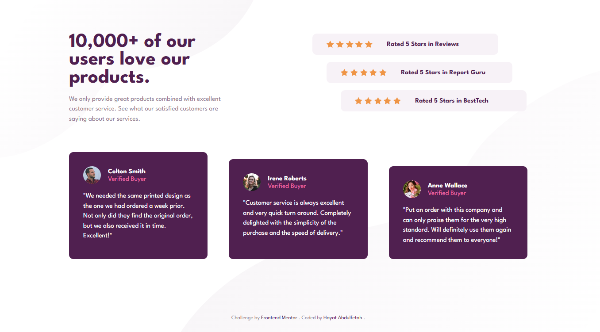

# Frontend Mentor - Social Proof Section Solution

This is my solution to the **Social Proof Section** challenge from Frontend Mentor. The goal was to recreate the provided design using semantic HTML and responsive CSS.

## 📸 Screenshot

  

## 🔗 Links

- **Solution URL:** *https://www.frontendmentor.io/solutions/creating-responsive-designs-with-media-queries-tyVT9P9Fh2*
- **Live Site URL:** *https://hayatabdulfetah.github.io/frontend-mentor-social-proof-section/*

## 🛠️ Built With

- Semantic HTML5
- CSS3
- Flexbox
- Responsive Design
- Desktop-first workflow
- Google Fonts (League Spartan)

## 💡 What I Learned

During this project, I practiced:

- Structuring webpages with semantic HTML.
- Building layouts using Flexbox.
- Creating responsive designs with media queries.
- Using SVG background images.
- Organizing CSS for readability and maintainability.
- Improving spacing and alignment to closely match a design.

## 🚀 Continued Development

In future projects, I would like to:

- Learn CSS Grid.
- Improve responsive design skills.
- Write cleaner and more reusable CSS.
- Build projects faster while maintaining clean code.

## 👤 Author

- GitHub: https://github.com/Hayatabdulfetah
- Frontend Mentor: https://www.frontendmentor.io/challenges/social-proof-section-6e0qTv_bA

## 🙏 Acknowledgments

Thanks to Frontend Mentor for providing realistic frontend challenges that help improve HTML and CSS skills.
